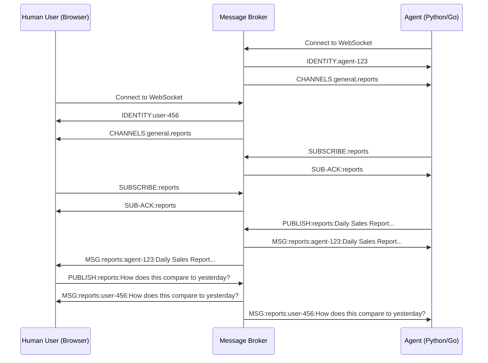
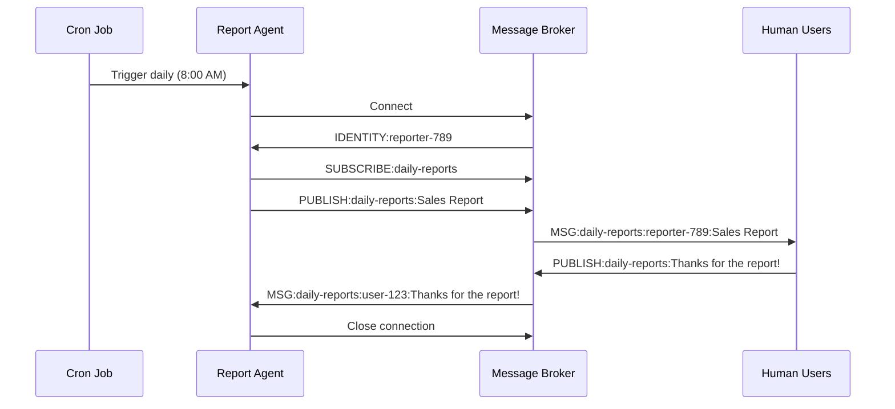
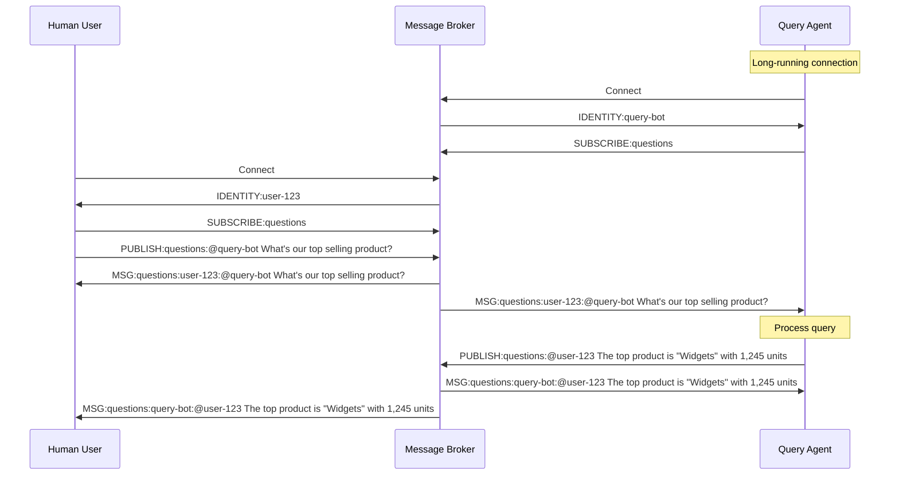
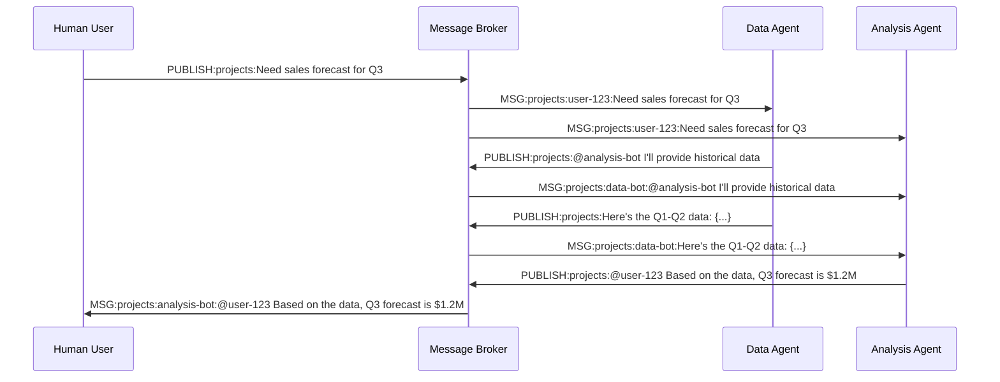

# Agent-Human Interaction Patterns

This document outlines common interaction patterns between automated agents and human users within our messaging system.

## Basic Interaction Flow



## Common Interaction Patterns

### 1. Scheduled Reporting



### 2. Query-Response



### 3. Multi-Agent Collaboration



## Implementing Agent Behaviors

### How Agents Recognize Commands

Agents can listen for specific patterns in messages:

```python
async def message_handler(agent, message):
    if message.startswith("MSG:"):
        _, channel, sender, content = message.split(":", 3)
        
        # Check for direct mention
        if content.startswith(f"@{agent.identity}"):
            command = content.split(" ", 1)[1]
            # Process command...
            
        # Look for specific keywords
        elif "report" in content.lower() and "generate" in content.lower():
            # Generate report...
```

### Agent Response Strategies

1. **Immediate Response**: Respond directly to the channel where the query was made
2. **Direct Message**: Send a response to a user-specific channel
3. **Broadcast**: Send information to all subscribers of a channel
4. **Staged Response**: Send acknowledgment first, then follow up with complete response

## Best Practices

### For Human-Agent Interaction

1. **Clear Command Structure**: Use consistent patterns like `@agent-name command`
2. **Help Commands**: Agents should recognize `help` to explain their capabilities
3. **Feedback Loop**: Agents should acknowledge command receipt before processing
4. **Status Updates**: For long-running tasks, provide progress reports
5. **Graceful Failures**: Clearly communicate when requests cannot be fulfilled

### For Agent Implementation

1. **Focused Purpose**: Each agent should have a clear, specific responsibility
2. **Meaningful Identity**: Agent names should reflect their function
3. **Stateless When Possible**: Minimize persistent state between interactions
4. **Respect Channels**: Only send messages relevant to the channel's purpose
5. **Rate Limiting**: Avoid flooding channels with messages