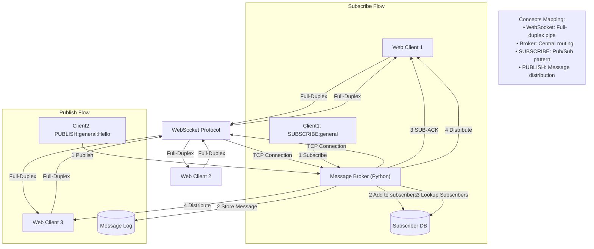

```mermaid
%% Data Flow Diagram for Python Messaging System
flowchart TD
    %% ================
    %% Components
    %% ================
    Client1[Web Client 1]
    Client2[Web Client 2]
    Client3[Web Client 3]
    Broker["Message Broker (Python)"]
    WebSocket[WebSocket Protocol]
    
    %% ================
    %% Connections (simplified)
    %% Replace custom arrows with standard Mermaid arrows
    Client1 -->|Full-Duplex| WebSocket
    WebSocket -->|Full-Duplex| Client1
    Client2 -->|Full-Duplex| WebSocket
    WebSocket -->|Full-Duplex| Client2
    Client3 -->|Full-Duplex| WebSocket
    WebSocket -->|Full-Duplex| Client3
    WebSocket -->|TCP Connection| Broker
    Broker -->|TCP Connection| WebSocket
    
    %% ================
    %% Data Flows
    %% ================
    subgraph "Subscribe Flow"
        direction TB
        S1[Client1: SUBSCRIBE:general] -->|1 Subscribe| Broker
        Broker -->|2 Add to subscribers| SDB[(Subscriber DB)]
        Broker -->|3 SUB-ACK| Client1
    end
    
    subgraph "Publish Flow"
        direction TB
        P1[Client2: PUBLISH:general:Hello] -->|1 Publish| Broker
        Broker -->|2 Store Message| MDB[(Message Log)]
        Broker -->|3 Lookup Subscribers| SDB
        Broker -->|4 Distribute| Client1
        Broker -->|4 Distribute| Client3
    end
    
    %% ================
    %% Legend
    %% ================
    legend[Concepts Mapping:
    • WebSocket: Full-duplex pipe
    • Broker: Central routing
    • SUBSCRIBE: Pub/Sub pattern
    • PUBLISH: Message distribution]
```
